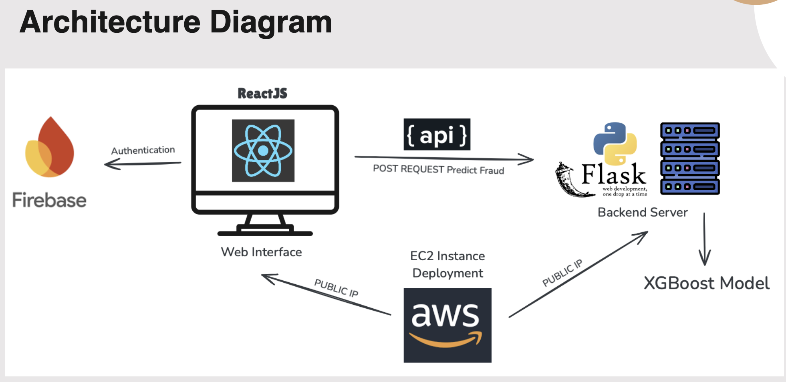

## Project Title: Fraud Detection System

### Project Description

This project aims to build a **Bank Account Fraud Detection System** that utilizes machine learning algorithms to identify fraudulent transactions in real-time. By leveraging historical transaction data and customer information, the system classifies transactions as either fraudulent or legitimate. The primary objective of this system is to help financial institutions detect and prevent fraud, improving security and trust in banking systems.

The system uses state-of-the-art machine learning models, including XGBoost, Random Forest, and Logistic Regression. The dataset used for training and prediction is from the **sgpjesus/bank-account-fraud-dataset-neurips-2022**. XGBoost was found to provide the best performance in fraud detection. The project is deployed on **AWS**, and the backend is powered by **Python (Flask)**, while the frontend is built using **ReactJS**. The system also integrates **Firebase** for secure user authentication.

### Objective

The goal of this project is to build a scalable fraud detection system that can accurately predict whether a bank transaction is fraudulent or not, using machine learning models trained on a large dataset. By automating the fraud detection process, the system aims to minimize losses caused by fraudulent transactions and enhance the overall security of banking platforms.

## Technologies

- **Frontend**: ReactJS
- **Backend**: Python (Flask)
- **Authentication**: Firebase
- **Machine Learning Models**: XGBoost, Random Forest, Logistic Regression
- **Deployment**: AWS

## Dataset

The dataset used is the **Bank Account Fraud Dataset** from the NeurIPS 2022 competition. It contains 1,000,000 entries with 32 features. The goal is to predict whether a transaction is fraudulent (`fraud_bool`). Below are the descriptions of the dataset attributes:

### Attributes:

- **fraud_bool**: (Target) Indicates if the transaction is fraudulent (1) or not (0).
- **income**: Customer's income (float).
- **name_email_similarity**: Similarity score between the customer's name and email (float).
- **prev_address_months_count**: Number of months the customer has lived at their previous address (integer).
- **current_address_months_count**: Number of months the customer has lived at their current address (integer).
- **customer_age**: Age of the customer (integer).
- **days_since_request**: Days since the transaction request was made (float).
- **intended_balcon_amount**: Intended balance change requested by the customer (float).
- **payment_type**: Type of payment method used for the transaction (categorical).
- **zip_count_4w**: Count of transactions in the customer's zip code in the last 4 weeks (integer).
- **velocity_6h**: Transaction frequency in the last 6 hours (float).
- **velocity_24h**: Transaction frequency in the last 24 hours (float).
- **velocity_4w**: Transaction frequency in the last 4 weeks (float).
- **bank_branch_count_8w**: Number of visits to bank branches in the last 8 weeks (integer).
- **date_of_birth_distinct_emails_4w**: Number of distinct emails associated with the customer's date of birth in the last 4 weeks (integer).
- **employment_status**: Employment status of the customer (categorical).
- **credit_risk_score**: Customer's credit risk score (integer).
- **email_is_free**: Whether the customer's email is from a free provider (1) or not (0).
- **housing_status**: Housing status of the customer (categorical).
- **phone_home_valid**: Whether the customer's home phone number is valid (1) or not (0).
- **phone_mobile_valid**: Whether the customer's mobile phone number is valid (1) or not (0).
- **bank_months_count**: Number of months the customer has been with their bank (integer).
- **has_other_cards**: Whether the customer has other cards (1) or not (0).
- **proposed_credit_limit**: The proposed credit limit for the customer (float).
- **foreign_request**: Whether the request is from a foreign country (1) or not (0).
- **source**: The source of the request (e.g., INTERNET) (categorical).
- **session_length_in_minutes**: Duration of the session in minutes (float).
- **device_os**: Operating system of the device used (categorical).
- **keep_alive_session**: Whether the session is kept alive (1) or not (0).
- **device_distinct_emails_8w**: Number of distinct emails associated with the device in the last 8 weeks (integer).
- **device_fraud_count**: Number of fraudulent transactions detected for the device (integer).
- **month**: Month of the transaction (integer).

## Training & Models

The following models were trained on the dataset:

1. **XGBoost**: Achieved the best performance in fraud detection.
2. **Random Forest**: Another strong model but with slightly lower accuracy than XGBoost.
3. **Logistic Regression**: A simpler model that performed adequately but less accurately than XGBoost.

The models were evaluated based on metrics like accuracy, precision, recall, and F1-score.

## Deployment

The project is deployed on **AWS**. The machine learning model is hosted via a **Python Flask API**, which serves predictions to the ReactJS frontend. **Firebase authentication** ensures secure login and user management.
<<<<<<< HEAD

### Public IPs:

- **Primary (Client Side) Website**: [http://3.22.68.191/](http://3.22.68.191/)
- **Backend (Flask Server)**: [http://3.145.167.93:3000/](http://3.145.167.93:3000/)

Ensure that these links are correctly used for accessing the frontend and the backend of the system.




## Accessing the Website

You can access the deployed version of the website by visiting:  
**[http://3.22.68.191](http://3.22.68.191)**

---

## Running the Project Locally

To run the project on your local machine, follow these steps:

### Prerequisites

Ensure you have the following installed on your machine:
- Python (3.8 or later)
- Node.js (14.x or later)
- npm (Node Package Manager)

### Instructions

1. **Clone the Repository**  
   Clone the repository to your local machine:
   ```bash
   git clone https://github.com/Abhinav-Sriharsha/CMPE272_Team2.git
   cd CMPE272_Team2

2. **Set Up the Backend Server**
   Navigate to the folder containing app.py and run the server:
   ```bash
   index.py

3. **Set up the Frontend**
   ```bash
   cd Website

   ```bash
   cd Client

   ```bash
   npm install

   ```bash
   npm run dev
   
4. **Access the website locally**
   Open your browser and navigate to the URL displayed in the terminal (typically http://localhost:3000).

**Additional Instructions :**
Ensure the backend server is running before starting the frontend.
If you encounter any issues, check the logs for detailed error messages.

